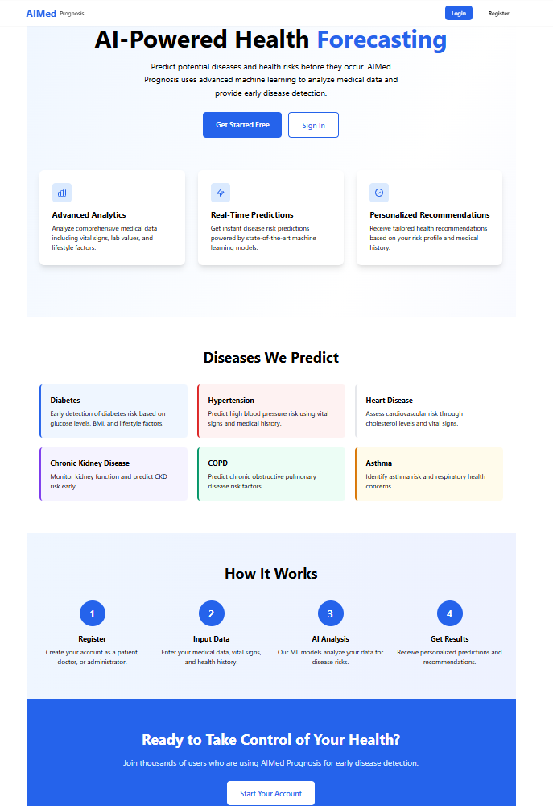
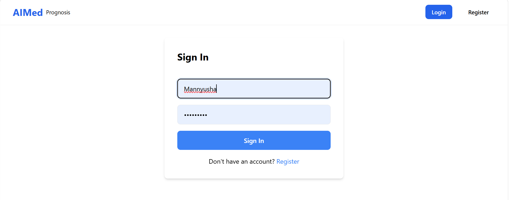
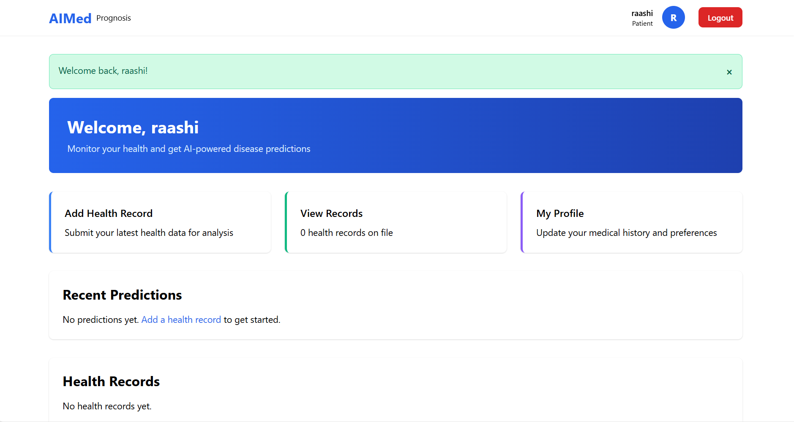
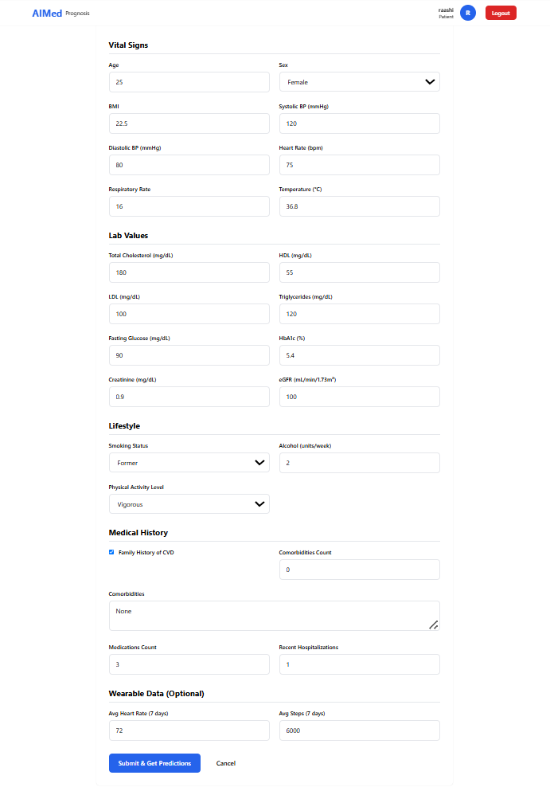
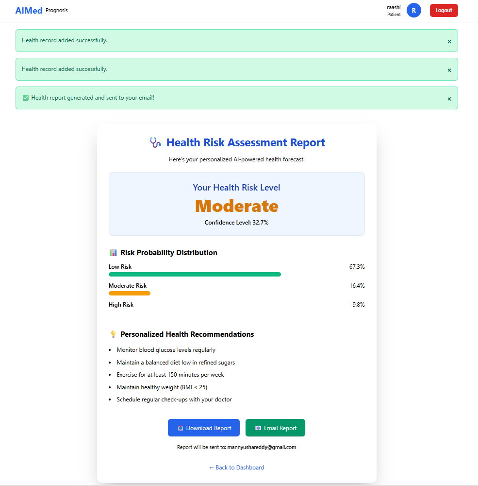
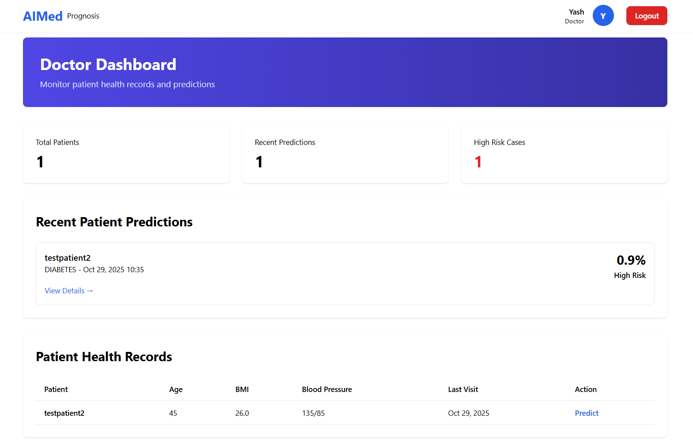
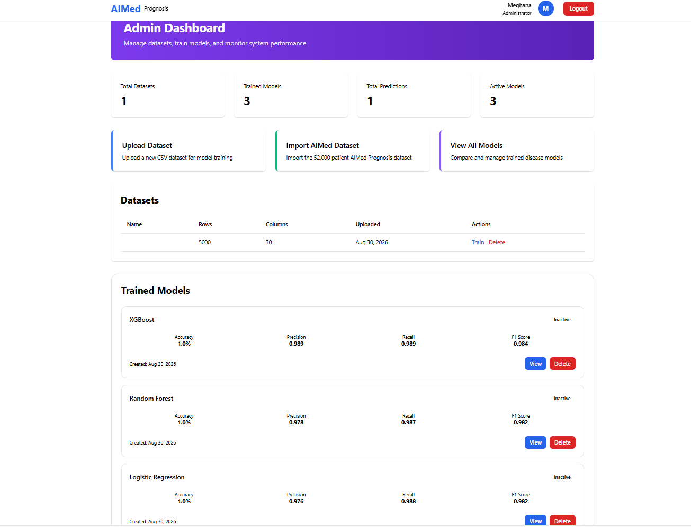
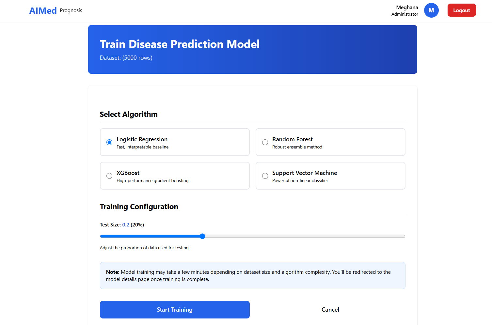
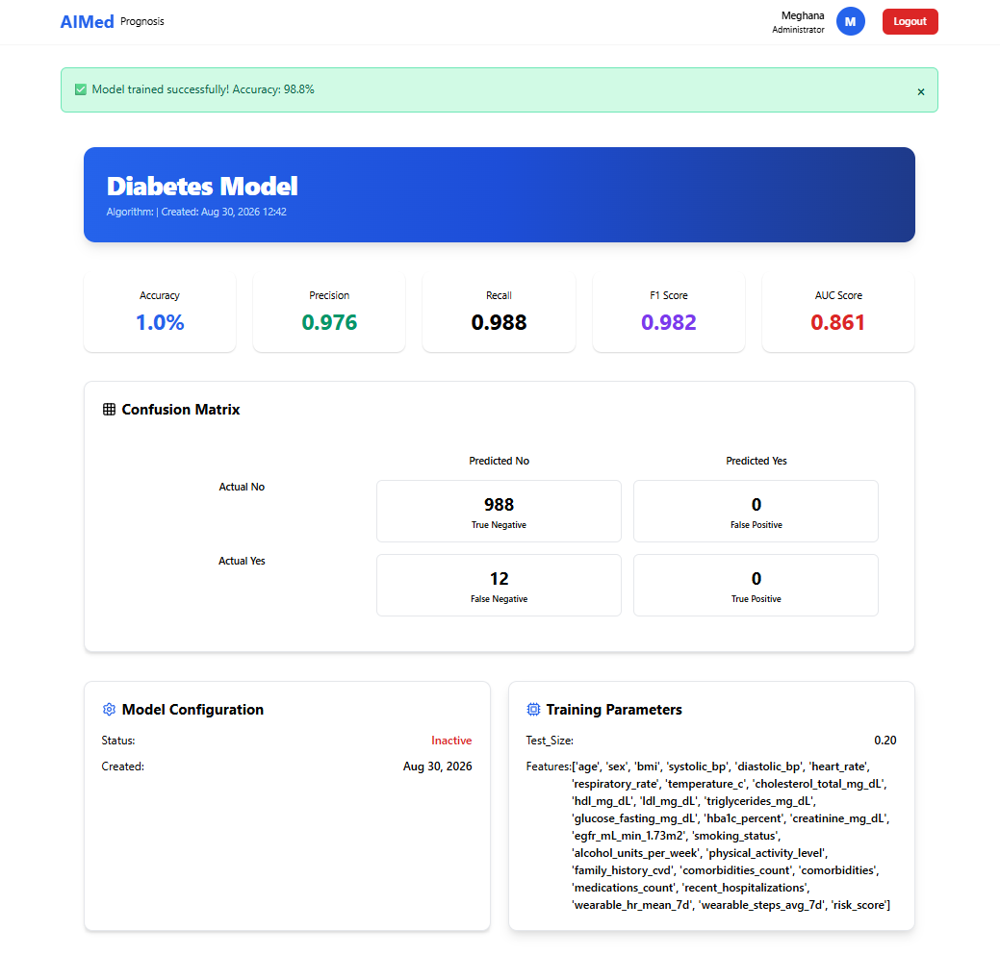

# 🩺 AI Med Prognosis

An AI-powered healthcare web application built with **Django** and **Machine Learning** that predicts disease risk based on patient health data. The system provides role-based dashboards for **Patients**, **Doctors**, and **Administrators**, enabling intelligent health risk prediction, patient monitoring, and machine learning model management.

---

## 🚀 Features

### 👤 Patient Module
- Secure Registration & Login
- Add Comprehensive Health Records
- AI-Based Disease Risk Prediction
- Personalized Health Recommendations
- Download Health Report as PDF
- Receive Health Report via Email
- View Previous Health Records

### 👨‍⚕️ Doctor Module
- View Patient Health Records
- Monitor Recent Predictions
- Identify High-Risk Patients
- Access Patient Prediction Details

### 👨‍💼 Admin Module
- Upload Medical Datasets
- Import Dataset for Training
- Train Machine Learning Models
- Compare Multiple ML Algorithms
- Manage Trained Models
- View Model Performance Metrics

---

## 🤖 Machine Learning Models

The application supports multiple classification algorithms for disease prediction:

- Logistic Regression
- Random Forest
- Support Vector Machine (SVM)
- XGBoost

Each trained model displays:

- Accuracy
- Precision
- Recall
- F1 Score
- AUC Score
- Confusion Matrix

---

## 🏥 Health Parameters Used

The prediction model analyzes various patient health attributes including:

- Age
- Gender
- BMI
- Blood Pressure
- Heart Rate
- Respiratory Rate
- Body Temperature
- Cholesterol Levels
- HDL
- LDL
- Triglycerides
- Fasting Glucose
- HbA1c
- Creatinine
- eGFR
- Smoking Status
- Alcohol Consumption
- Physical Activity
- Family History
- Comorbidities
- Medication Count
- Hospitalizations
- Wearable Device Data
- Average Heart Rate
- Daily Steps

---

## 🛠️ Tech Stack

### Frontend
- HTML5
- CSS3
- JavaScript

### Backend
- Python
- Django

### Database
- SQLite3

### Machine Learning
- Scikit-learn
- XGBoost
- Pandas
- NumPy

### Additional Libraries
- ReportLab
- Requests
- Joblib

---

# 📸 Application Screenshots

## Home Page



---

## Login Page



---

## Patient Dashboard



---

## Health Prediction Form



---

## Prediction Report



---

## Doctor Dashboard



---

## Admin Dashboard



---

## Model Training



---

## Model Performance



---

## 📂 Project Structure

```
AI-Med-Prognosis
│
├── AIMed/
├── core/
├── Datasets/
├── media/
├── static/
├── templates/
├── screenshots/
├── manage.py
├── requirements.txt
└── README.md
```

---

## ⚙️ Installation

Clone the repository

```bash
git clone https://github.com/YOUR_USERNAME/AI-Med-Prognosis.git
```

Move into the project directory

```bash
cd AI-Med-Prognosis
```

Install dependencies

```bash
pip install -r requirements.txt
```

Run migrations

```bash
python manage.py migrate
```

Start the development server

```bash
python manage.py runserver
```

Open:

```
http://127.0.0.1:8000
```

---

## 🎯 Future Improvements

- Deploy on AWS or Azure
- Real-time wearable device integration
- Medical appointment scheduling
- Doctor-patient chat system
- Email verification
- REST API for mobile application
- AI model explainability
- Cloud database integration

---

## 👩‍💻 Developed By

**K. Mannyusha Reddy**

B.Tech Computer Science Engineering

Python | Django | JavaScript | SQL | Machine Learning

📧 mannyushareddy@gmail.com

🔗 LinkedIn: https://www.linkedin.com/in/mannyusha-reddy-b32a842b5

🔗 GitHub: https://github.com/mannyusha

---

## ⭐ If you like this project

Give this repository a ⭐ on GitHub.
